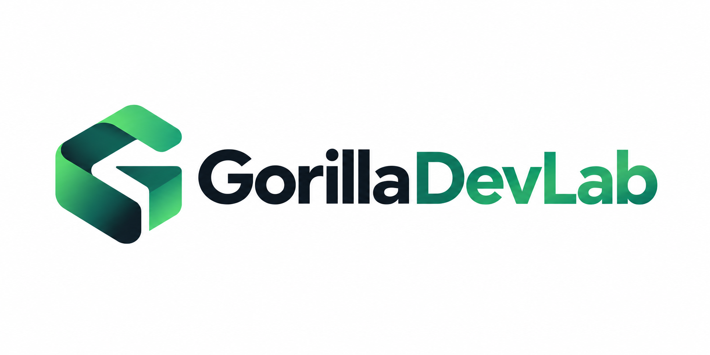

  

 

  <strong>Build useful things with AI.</strong>

  AI Agents · Intelligent Applications · Developer Tools · Experiments

 

## GorillaDevLab

GorillaDevLab is an independent software lab focused on building practical AI-powered products.

We explore how modern AI systems can move beyond simple chat interfaces — into tools that can understand context, use APIs, work with real-world data, and complete meaningful tasks.

Our work currently focuses on:

- **AI Agents** — tool use, workflows, orchestration and autonomous task execution
- **AI Applications** — turning LLM capabilities into usable products
- **RAG & Knowledge Systems** — retrieval, search and contextual intelligence
- **Full-Stack Engineering** — building production-ready web applications around AI
- **Developer Experiments** — testing new models, APIs and interaction patterns

 

## Projects

We build, test, break, rebuild, and ship.

Some projects are experiments.  
Some become real products.

→ [Explore our repositories](https://github.com/orgs/GorillaDevLab/repositories)

 

---

  GorillaDevLab · Building software for the AI era.

